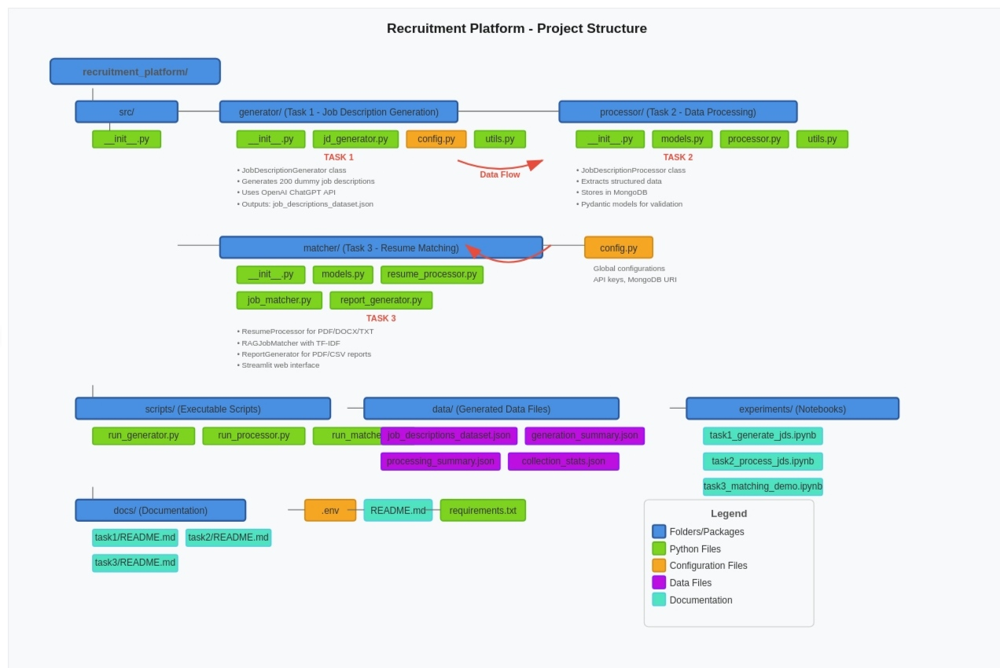

# AI-Powered Recruitment Platform

This AI-powered platform matches candidate resumes to job descriptions using OpenAI and MongoDB. It provides intelligent recommendations and allows companies to process resumes and job descriptions efficiently.


## 🚀 Local Setup Instructions

### 1. Clone the Repository

```bash
git clone https://github.com/FathimaHusna/ai_recruitment_platform.git
cd ai_recruitment_platform
```

### 2. Set Up Virtual Environment

```bash
python3 -m venv venv
source venv/bin/activate
```

### 3. Install Dependencies

```bash
pip install -r requirements.txt
```

### 4. Configure Environment Variables

- OPENAI_API_KEY=your-openai-key
- MONGODB_URI=mongodb+srv://<username>:<password>@ac-whgkafg.rosecne.mongodb.net/recruitment_platform?retryWrites=true&w=majority&tls=true
- MONGODB_DATABASE_NAME=recruitment_platform

#### Note:
- Replace your-openai-key with your OpenAI API key from OpenAI Platform.

- Replace <username> and <password> with your MongoDB Atlas credentials.


## 🧪 Run Tasks Locally

#### Task 1: Generate Job Descriptions
```bash
python -m scripts.run_generator
```

#### Task 2: Process Job Descriptions

```bash
python -m scripts.run_processor
```

#### Task 3: Run the Streamlit Application

```bash
streamlit run scripts/run_matcher.py
```

- Access the app at: http://localhost:8501


## 🌐 Deployment Instructions
### 1. Prepare Application

- Ensure all dependencies are listed:
```bash
pip freeze > requirements.txt
```
- project structure




### 2. Configure Streamlit Cloud
    - Sign in at Streamlit Cloud

    - Create a new app linked to your GitHub repo: FathimaHusna/ai_recruitment_platform

    - Set main file path: scripts/run_matcher.py

### 3. Add Secrets in Streamlit Cloud

#### In secrets.toml:

* OPENAI_API_KEY = "your-openai-key"
* MONGODB_URI = "mongodb+srv://<username>:<password>@ac-whgkafg.rosecne.mongodb.net/recruitment_platform?retryWrites=true&w=majority&tls=true"
* MONGODB_DATABASE_NAME = "recruitment_platform"

#### Use the same values as in .env.

### 4. Deploy the Application

```bash
git add .
git commit -m "Prepare for Streamlit Cloud deployment"
git push origin main
```

- Streamlit will auto-deploy. Access your app via the shareable link.
### 5. Verify Deployment
- Upload a resume and check job recommendations.

- Ensure MongoDB data retrieval is functioning.


