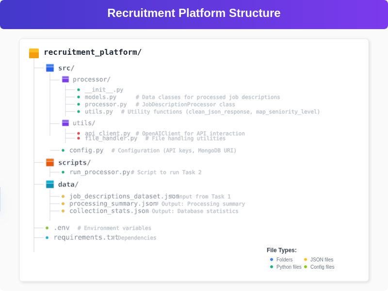

# ecruitment Platform - Task 2: Job Description Processor
## Task 2 Description
- Task 2 processes job descriptions from a JSON file (generated in Task 1) using an OpenAI LLM to extract structured fields like job title, category, skills, responsibilities, qualifications, salary range, and summary. The processed data is stored in a MongoDB Atlas database, and summary statistics are generated for analysis.

## Project Structure
### Relevant files for Task 2:



## Processes

1. Input: Reads data/job_descriptions_dataset.json (from Task 1).
2. Processing: Uses OpenAI LLM to extract structured fields from each job description.
3. Storage: Saves processed data to the job_descriptions collection in MongoDB Atlas (recruitment_platform database).
4. Output:
- data/processing_summary.json: Summary of processing (total jobs, successful/failed).
- data/collection_stats.json: Database stats (total jobs, categories, top skills).


Execution: Run via  

```bash
python scripts/run_processor.py
```


## Setup

- Install Dependencies:
```bash
cd recruitment_platform
```

```bash
python -m venv venv
```
```bash
source venv/bin/activate  # On Windows: venv\Scripts\activate
```
```bash
pip install -r requirements.txt
```


* Required: openai, pymongo, python-dotenv.

* Configure .env:

* Run Task 1 (if needed):
```bash
python scripts/run_generator.py
```

* Run Task 2:
```bash
python scripts/run_processor.py
```

